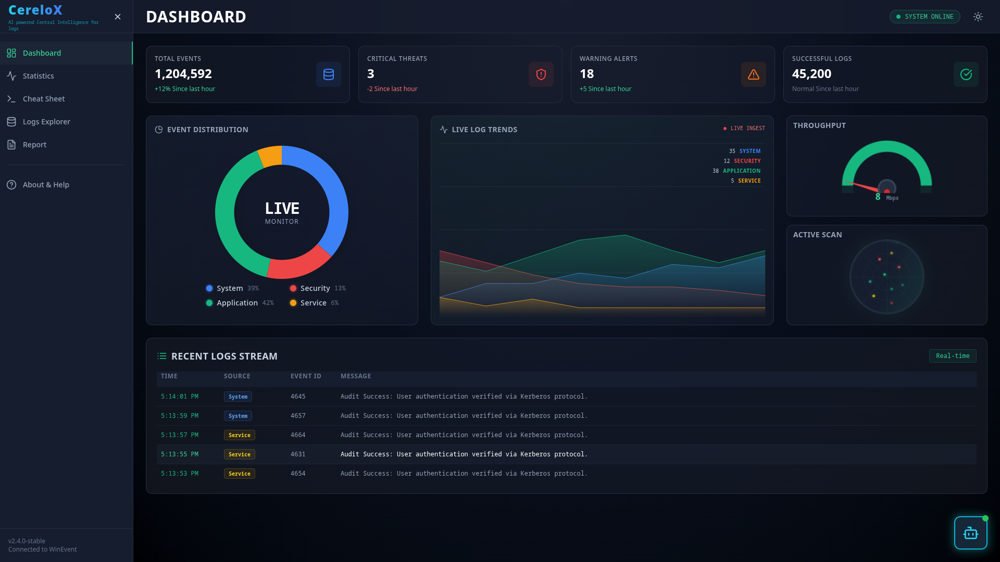

 # CereLoX

AI-Powered Central Intelligence for logs

A modern, secure, on-device Windows log analysis tool built for students and beginners.




**[Explore the Download Page ↗](https://cerelox-download-page.YOUR-USERNAME.replit.dev)**

---

## Introduction

**CereLoX** is a user-friendly log analysis tool designed for everyone. Its mission is to provide security insights and peace of mind by making high-grade log analysis simple, without requiring technical expertise.

The core of CereLoX is its **on-device security model**. Unlike other services that require you to upload your sensitive system logs to the cloud, all analysis happens locally on your computer. Your files are never transmitted, never stored, and never seen by us. You hold the keys, you hold the data, and you have total control.

---

## ✨ Key Features

* **🤖 AI-Powered Explanations:** Integrated with the **Gemini API** to provide simple explanations of complex security concepts and summarize your specific log data.
* **📈 Live Dashboard:** Utilizes **Chart.js** to display a live, auto-updating dashboard of event trends, errors, and critical security alerts.
* **💻 On-Device Security:** All operations are performed client-side. Your sensitive Windows logs **never leave your computer**, ensuring absolute privacy.
* **⚙️ Automated Log Fetching:** Automatically fetches and parses Security, System, and Application logs from the Windows Event Viewer in real-time.
* **📄 Professional Reports:** Generate and download comprehensive reports of your system's activity in **PDF**, **CSV**, or **JSON** formats.
* **📦 Simple `.exe` Installer:** Packaged as a single executable file using **PyInstaller**. No complex setup or dependencies needed.
* **💡 Light & Dark Mode:** A sleek, modern UI with a theme toggle that respects your system preferences.

---

## Technology Stack


---

```.
├── LICENSE
├── my-cyber-dashboard
│   ├── cerelox_logs.db
│   ├── CyberChatbot.jsx
│   ├── eslint.config.js
│   ├── index.html
│   ├── package.json
│   ├── package-lock.json
│   ├── postcss.config.js
│   ├── public
│   │   └── vite.svg
│   ├── README.md
│   ├── server-main.py
│   ├── server.py
│   ├── src
│   │   ├── App.css
│   │   ├── Appinitial.jsx
│   │   ├── App.jsx
│   │   ├── App- see Later.jsx
│   │   ├── assets
│   │   │   └── react.svg
│   │   ├── index.css
│   │   └── main.jsx
│   ├── tailwind.config.js
│   └── vite.config.js
└── README.md
```

## How It Works

Using CereLoX is as easy as 1-2-3. Here's how you can secure and restore your files in a few simple steps.

### 1. Launch the Tool 🚀

1.  **Download and Run** the `CereLoX.exe` file from our website.
2.  **That's it!** The tool will automatically open your default web browser to the CereLoX dashboard at `http://localhost:8888`.

### 2. Analyze Your Dashboard 📊

1.  **View Your Data:** Instantly see charts and key metrics (like Failed Logins, System Errors) from the last 24 hours.
2.  **Toggle Live Mode:** Click the "Live Mode" switch to have the dashboard auto-refresh every 10 seconds with new log data.

### 3. Chat with the AI 🤖

1.  **Click the Chat Icon** to open the floating AI assistant.
2.  **Ask About Your Data:** "How many failed logins did I have today?"
3.  **Ask General Questions:** "What is Event ID 4625?"

### 4. Generate Reports 📄

1.  **Navigate to the Reports Tab** in the dashboard.
2.  **Select Your Format:** Click "Download PDF," "Download CSV," or "Download JSON."
3.  **Save Your File:** A professional report will be instantly generated and saved to your computer.

---

## Authors

**Team SaEcho**

* **Email:** `infa.ismailai@gmail.com infa.khadershareef@gmail.com`
* **GitHub:** ` [github.com/ismailali025] [github.com/KHADERSHAREEF19]`
* **LinkedIn:** `[linkedin.com/in/Ismail Ali]`

---

## License

This project is distributed under the MIT License. See `LICENSE` for more information.

---

## Acknowledgements

* **Flask** for the powerful and simple micro-backend.
* **Google Gemini** for the AI integration.
* **Chart.js** for the beautiful and responsive charts.
* **PyInstaller** for the hassle-free `.exe` packaging.
* **ReportLab** for the PDF report generation.
